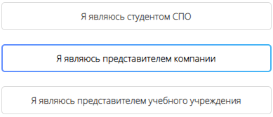
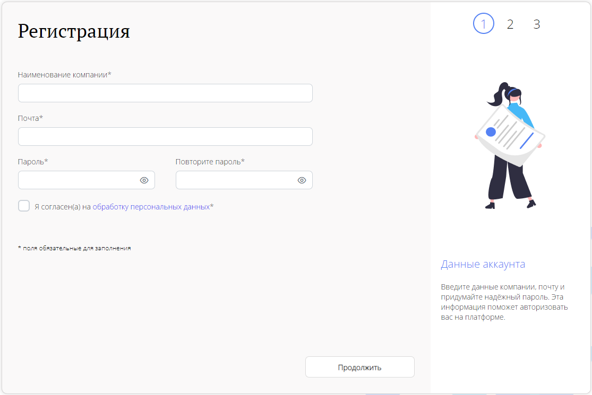
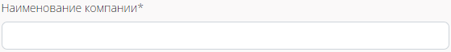
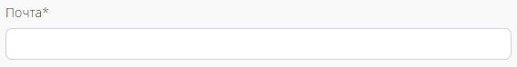
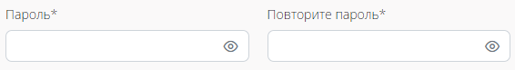
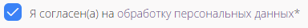
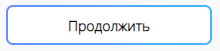
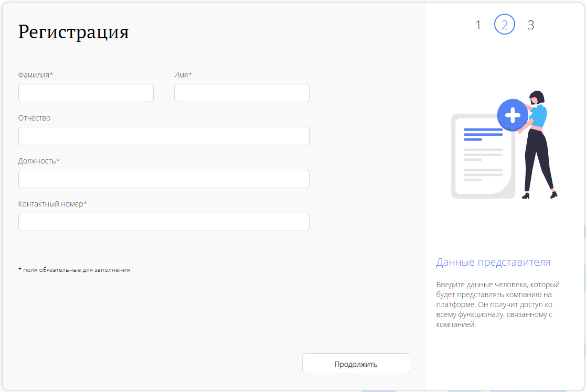

# Регистрация Компании
Чтобы компании начать регистрацию на платформе, нужно перейти
на окно авторизации через кнопку **Вход и регистрация**.

Поскольку сейчас мы рассматриваем случай регистрации компании,
мы из предложенных вариантов регистрации, должны выбрать второй:
**Я являюсь представителем компании**.

## Первый этап регистрации
После выбора первого пункта, пользователю открывается первая
страница регистрации.

Обязательные поля на этой странице помечены ***(Звездочкой)**.

### Ввод Наименования компании
Поле **Наименование компании** - это обязательное поле для заполнения.
В него пользователь должен вписать название компании, которая регистрируется на платформе.

### Ввод Почты
Поле **Почта** - это обязательное поле для заполнение.
В него пользователь должен вписать адрес своей электронной почты.

Эта почта будет использоваться, как логин пользователя на платформе.
Также на эту почту будут приходить уведомления по платформе.
Почтовый адрес после регистрации можно будет сменить в **Личном кабинете**.

### Ввод Пароля
Поле **Пароль** и **Повторите пароль** - это обязательные поля для заполнения.
В поле **Пароль**, пользователь придумывает и прописывает свой пароль, 
который будет использоваться для входа в платформу. 

Пароль имеет несколько требований к себе:

1. Он должен состоять минимум из 8, и максимум из 32 символов.
2. Он может состоять из букв кириллицы и латиницы, спецсимволов(@&*#$~.,!?^()[]) и цифр.
3. В пароле обязательно должны быть: Одна заглавная буква, одна строчная буква и одна цифра.

### Кнопка Согласия На Обработку Персональных Данных
Для продолжения регистрации пользователь должен 
согласиться на обработку своих персональных данных.
Это согласие необходимо, чтобы платформа могла выполнять свою главную задачу,
по обеспечению взаимодействия между компаниями, студентами и образовательными организациями.

## Второй Этап Регистрации
После заполнения всех необходимых данных на первой странице регистрации,
пользователь сможет нажать кнопку **Продолжить**. 

При нажатии на нее, пользователь начнет заполнение данных на второй странице регистрации.

