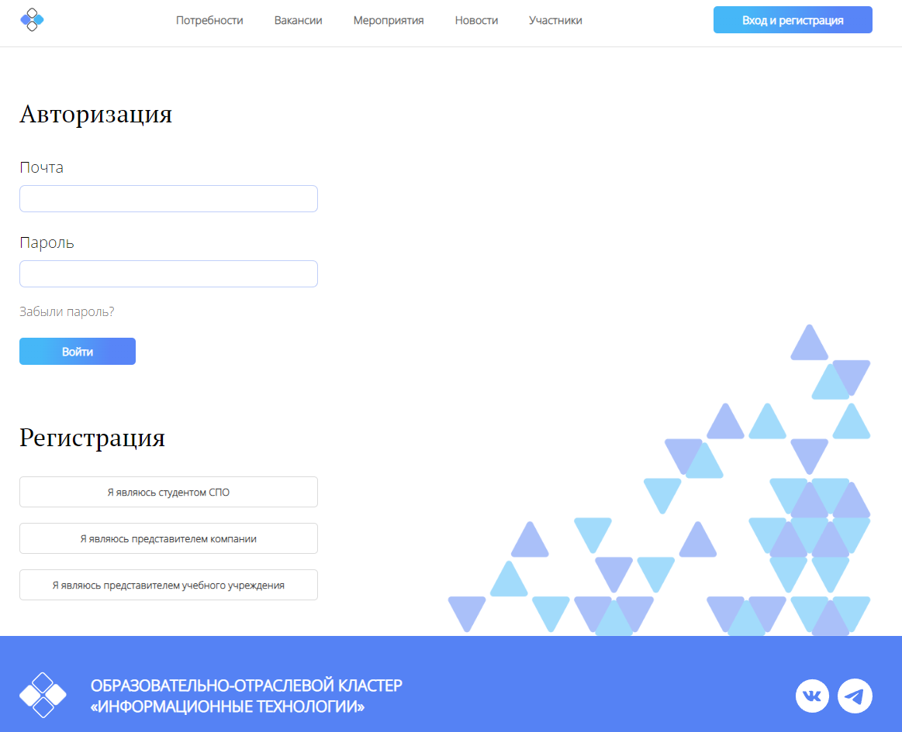

# Авторизация сотрудника компании

## Авторизация
Чтобы выполнить авторизацию на платформе, пользователь на главной странице должен нажать на кнопку
"Вход и регистрация".

После нажатия на эту кнопку, пользователь попадет на страницу авторизации.

На ней, пользователь должен в поле под написью "Почта", вписать электронную почту, которую
он вписывал во время регистрации на платформе.

После почты, пользователь должен в поле ниже, что под надписью "Пароль", вписать пароль, который он
использовал при регистрации на платформе.

Вписав почту и пароль, пользователь должен нажать кнопку "Войти".

Если пользователь вверно ввёл данные, тогда после нажатия кнопки, его переадресует на Главную
и вместо кнопки "Вход и регистрация", будет кнопка "Личный кабинет".

