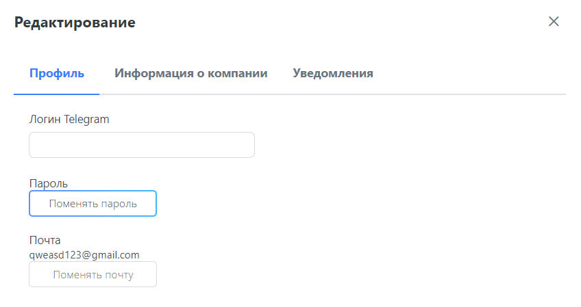

# Личный кабинет компании

## Предназначение
В личном кабинете вы можете увидеть и отредактировать всю информацию, относящуюся к вашему аккаунту. Более подробно в руководстве ниже.

## Переход в личный кабинет
Для того чтобы перейти в профиль сотрудника компании, вам необходимо навести курсор мыши на вкладку "Личный кабинет" и нажать на кнопку "Профиль" в верхней части сайта.

## Просмотр информации
После перехода в личный кабинет вы можете просмотреть всю доступную информацию о текущем аккаунте в специальной карточке сотрудника компании.

## Редактирование информации
Для того чтобы отредактировать какую-либо информацию, относящуюся к своему аккаунту, необходимо нажать на кнопку "Редактировать" в карточке сотрудника.

### Смена пароля
Для того чтобы сменить пароль от своего аккаунта, в окне редактирования на вкладке "Профиль" нажмите на кнопку "Поменять пароль".

В открывшемся окне введите все требуемые данные и нажмите на кнопку "Изменить".

### Редактирование личной информации
Каждый сотрудник компании может отредактировать часть информации о себе, например сменить почту или ссылку на Telegram-аккаунт. Доступная к редактированию личная информация находится в окне редактирования на вкладке "Профиль".

### Редактирование информации о компании
Сотрудникам компании с правами администратора доступна функция редактирования информации о компании, для этого в окне редактирования необходимо перейти на вкладку "Информация о компании". Обновите данные и нажмите на кнопку "Изменить".

### Настройка уведомлений на почту и телеграм
На вкладке "Уведомления" можно настроить уведомления, которые приходят на почту и телеграм. Например, вы можете оставить уведомления с определенных страниц сайта.

# Просмотр отзывов о компании
Обратите внимание на отзывы о компании, оставленные студентами. Они располагаются в нижней части страницы профиля в личном кабинете.

Платформа сильнее продвигает компании с лучшим рейтингом, поэтому им становится проще привлекать студентов на собственные потребности, мероприятия и вакансии.