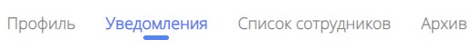

# Уведомления компании

## Предназначение
На странице уведомлений можно увидеть полезные информационные сообщения о произошедших на платформе событиях, связанных с вами деятельностью вашей компании. Например, уведомление об отклике на вакансию или потребность.

Помните, что тут речь идёт только об уведомлениях внутри платформы. Настроить уведомления на почту и в телеграм вы можете на [странице профиля](https://cluster-guide.readthedocs.io/Компаниям/Личный%20кабинет/#_9)

## Переход на страницу
Для перехода на страницу со списком уведомлений необходимо перейти в личный кабинет, а затем выбрать вкладку "Уведомления".

