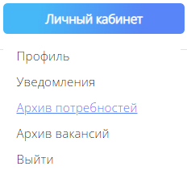
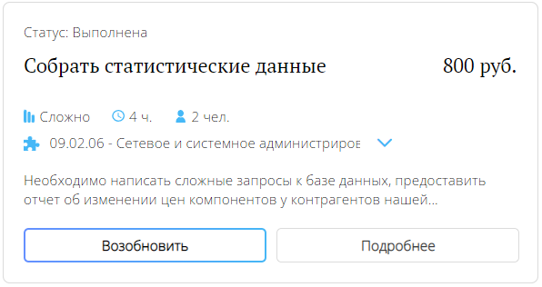

# Архив потребностей

## Назначение страницы
Если потребность была выполнена или отменена, вы сможете найти её на странице архива потребностей. Архив позволяет возобновлять потребности и просматривать информацию об уже завершенных потребностях. Вы можете перейти в архив потребностей через всплывающее меню при наведении на кнопку "Личный кабинет".

## Просмотр подробной информации
Вы можете посмотреть страницу с подробной информацией о завершенной потребности. Для этого перейдите к нужной потребности в архиве и нажмите на кнопку "Подробнее".

## Возобновление потребности
Вы можете создать новую потребность на основании старой. Потребность будет создана заново, однако все основные данные вроде наименования и описания будут сохранены. Для этого перейдите к нужной потребности в архиве и нажмите на кнопку "Возобновить".

