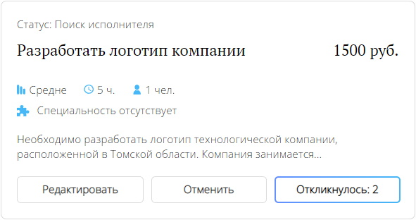
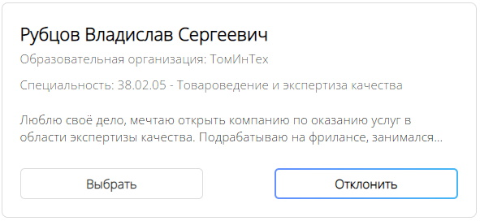

# Отклики студентов

## Требуемые права
Если вы не являетесь администратором компании, доступ к взаимодействию с откликами может быть ограничен. В случае несовпадения каких-либо блоков из перечисленного руководства, скорее всего проблема именно в правах. Уточните у администратора компании, есть ли у вас доступ к функционалу откликов.

## Просмотр откликов
Если студент откликнулся на потребность компании, вы получите уведомление об этом. Посмотреть полный список откликнувшихся студентов можно на странице откликов.

## Рассмотрение откликов
Для рассмотрения откликов необходимо перейти на специальную страницу, для этого нажмите на кнопку "Откликнулось" в правой части карточки потребности.

### Кнопка неактивна
Если на кнопку нажать не получается, скорее всего на вашу потребность ещё никто не откликнулся. Вы можете ещё немного подождать, либо отредактировать карточки.

- **Опишите задачу более подробно** — если информации мало, студент может не понять суть задачи. На такую потребность мало кто захочет откликаться.
- **Пересмотрите оплату за потребность** — оплата должна быть пропорциональна затраченному труду. Если решение задачи требует много сил и времени, лучше не оставлять её без оплаты.
- **Уточните требуемые специальности** — выберите специальности, подходящие для решения вашей задачи. Это продвинет карточку выше и привлечёт больше студентов.

### Просмотр информации о студенте
Вы можете увидеть карточки откликнувшихся студентов на странице откликов. Чтобы посмотреть более подробную информацию о студенте, нажмите по его имени. Вам откроется окно с отзывами о студенте, его достижениями и другой информацией.

### Отклонение откликов
Вы можете отклонить студента, который по вашему мнению не подходит для решения выбранной задачи. Найдите его в списке откликов и нажмите на кнопку "Отклонить".

### Принятие откликов
Вы можете принять до 10 подходящих на потребность студентов. Для этого нажмите на кнопку "Выбрать" в карточках подходящих студентов и подтвердите свой выбор нажатием на кнопку "Принять". Автоматически будет создан чат, где вы сможете обсудить с выбранными студентами необходимые шаги для решения потребности компании.
