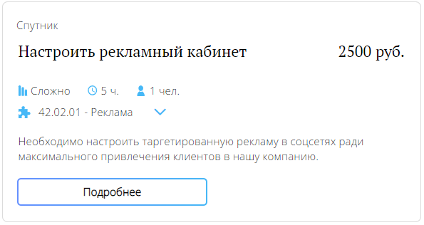

# Потребности компании

## Требуемые права
Если вы не являетесь администратором компании, доступ к взаимодействию с потребностями может быть ограничен. В случае несовпадения или отсутствия каких-либо блоков из перечисленного руководства, скорее всего проблема именно в правах. Уточните у администратора компании, есть ли у вас доступ к нужному функционалу.

## Просмотр потребностей

### Блок "Потребности"

В данном блоке отображаются карточки с краткой информацией по открытым на платформе потребностям не относящимся к вашей компании.

Среди них вы можете искать идеи для создания своих собственных потребностей.

### Блок "Потребности компании"

Отображается только подтверждённым компаниям, у которых имеются активные потребности со статусами "В поиске исполнителя" и "В процессе".

### Фильтрация и сортировка

Существует возможность упростить отображение списка потребностей, выбрав дополнительные фильтры и сортировки.

## Подробная информация

Страницу с подробной информацией можно открыть нажатием на кнопку "Подробнее".

## Создание потребности

Если у вас есть права на создание потребности, заполните все необходимые данные в блоке добавления потребности и нажмите на кнопку "Добавить".

- Название потребности — заголовок потребности, кратко отображающий суть задачи.
- Описание — вся подробная информация, чтобы лучше понять суть задачи.
- Адрес — место, куда студенту нужно будет подойти для решения задачи.
- Специальность — наиболее подходящие специальности студентов.
- Время — примерное время, которое студенту придется потратить на решение задачи.
- Оплата — размер денежного вознаграждения, либо 0 при его отсутствии.
- Сложность — насколько по вашему мнению будет сложно решить эту задачу.

## Редактирование потребности

Если у вас есть права на редактирование потребности, вам будет доступна кнопка "Редактировать" в блоке потребностей компании. Помните, что отредактировать можно только потребности со статусом "Поиск исполнителя".

  

При нажатии на кнопку "Редактировать" откроется окно с возможностью обновить необходимые данные. Для сохранения изменений нажмите на кнопку "Изменить".

## Отмена потребности

Если у вас есть права на отмену потребности, вам будет доступна кнопка "Отменить". Нажмите на неё для отмены выбранной потребности.

После отмены потребности вы сможете найти её в архиве потребностей.