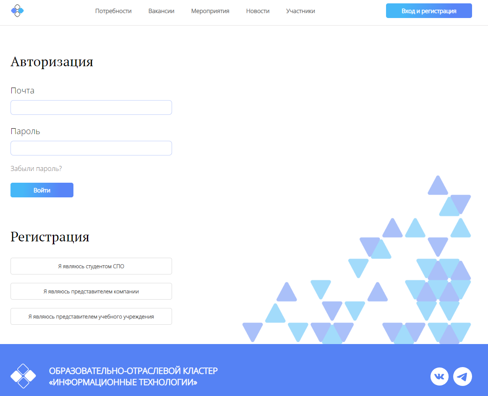

# Авторизация сотрудника образовательной организации

## Авторизация
Для авторизации на платформе необходимо на главной странице нажать на кнопку
"Вход и регистрация".

После нажатия на эту кнопку откроется страница авторизации.

На ней необходимо в поле "Почта" вписать адрес электронной почты, указанный при регистрации на платформе.

После почты необходимо ввести свой пароль в поле "Пароль".

Вписав все данные необходимо нажать на кнопку "Войти".

Если данные введены верно, после нажатия на кнопку произойдет переадресация на Главную страницу.
Вместо кнопки "Вход и регистрация" появится кнопка "Личный кабинет".

