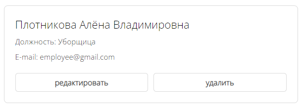
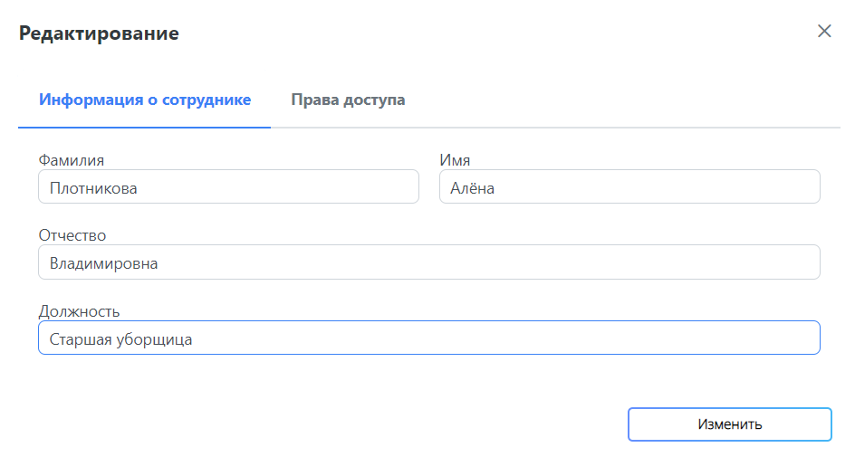

# Сотрудники компании

## Требуемые права
Если вы не являетесь администратором ОУ, доступ к просмотру и редактированию сотрудников компании может быть ограничен.

## Переход на страницу
Для перехода на страницу с сотрудниками ОУ необходимо перейти в личный кабинет, а затем выбрать вкладку "Список сотрудников".

## Просмотр сотрудников компании
### Карточки сотрудников
На вкладке "Список сотрудников" вы сможете найти карточки сотрудников ОУ с краткой информацией о них, включая ФИО, должность и адрес электронной почты.

### Сортировка
Для упрощения поиска конкретных сотрудников можно применять сортировку.

## Редактирование информации о сотрудниках
У администратора ОУ существует возможность редактирования информации о сотрудниках. Для этого необходимо нажать на кнопку "Редактировать" в карточке нужного сотрудника, обновить данные и нажать на кнопку "Изменить".

## Редактирование прав сотрудников
Администратор компании может редактировать права сотрудников. Для перехода к редактированию прав нажмите на кнопку "Редактировать" в карточке сотрудника. Обновите разрешения на вкладке "Права доступа" и нажмите на кнопку "Изменить".

