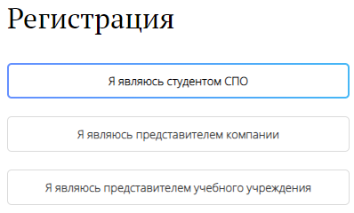
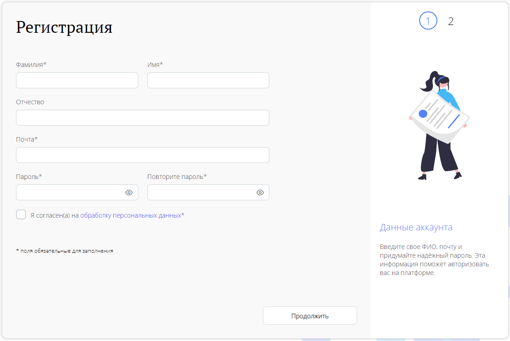
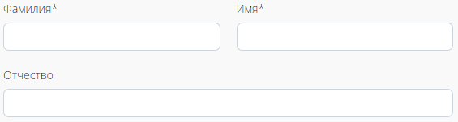

# Регистрация студента
Чтобы студенту начать регистрацию на платформе, 
нужно перейти на окно авторизации через кнопку **Вход и регстрация**.

Поскольку сейчас мы рассматриваем случай регистрации студента, 
мы из предложенных вариантов регистрации, 
должны выбрать первый: **Я явлюсь студентом СПО**

## **Первый этап регистрации**
После выбора первого пункта, 
пользователю открывается первая страница регистрации.

Обязательные поля на этой странице помечены ***(Звездочкой)**.

Рассмотрим все поля поподробнее...

### **Поля ФИО**
Поле **Фамилия** и **Имя** - это обязательные поля для заполнения.
В них пользователь должен написать свою настоящую фамилию и имя.
Их пользователь будет использовать на платформе 
и они будут видны компаниям при отклике пользователя.

Помимо этого, пользователь может заполнить необязательное поле **Отчество**.
Если пользователь не заполнит это поле во время регистрации,
он будет иметь возможность заполнить его, после регистрации на платформе,
в **Личном кабинете**.

### **Поле Почты**
Поле **Почта** - это обязательное поле для заполнение.
В него пользователь должен вписать адрес своей электронной почты.

Эта почта будет использоваться, как логин пользователя на платформе.
Также на эту почту будут приходить уведомления по платформе.
Почтовый адрес после регистрации можно будет сменить в **Личном кабинете**.

### **Поля Пароль и Повторите пароль**
Поле **Пароль** и **Повторите пароль** - это обязательные поля для заполнения.
В поле **Пароль**, пользователь придумывает и прописывает свой пароль, 
который будет использоваться для входа в платформу. 

Пароль имеет несколько требований к себе:

1. Он должен состоять минимум из 8, и максимум из 32 символов.
2. Он может состоять из букв кириллицы и латиницы, спецсимволов(@&*#$~.,!?^()[]) и цифр.
3. В пароле должны обязательные должны быть: Одна заглавная буква, одна строчная буква и одна цифра.

## **Второй этап регистрации**
Вводим пароль жестко

## **Третий этап(Или нет?)**
