# Регистрация Студента
Для начала регистрации на платформе, 
необходимо нажать на кнопку **Вход и регистрация**.

Из предложенных вариантов регистрации выбираем **Я студент СПО**

.png)

## Первый Этап Регистрации
После выбора первого пункта, открывается первая страница регистрации.

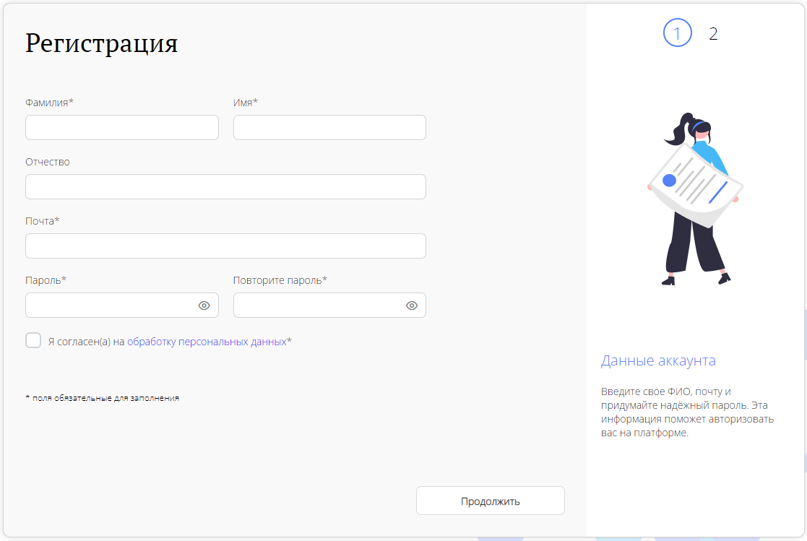

Обязательные поля на этой странице помечены ***(Звездочкой)**.

Рассмотрим все поля поподробнее...

### Ввод ФИО
Поле **Фамилия** и **Имя** - это обязательные поля для заполнения.
В них необходимо написать свою настоящую фамилию и имя.
Эти данные будут видны представителям компаний.

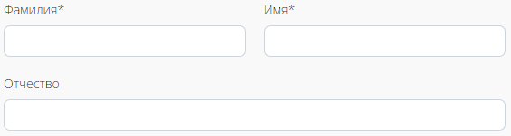

Также можно заполнить необязательное поле **Отчество**.

### Ввод Почты
Поле **Почта** - это обязательное поле, в которое необходимо вписать адрес своей электронной почты.

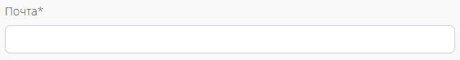

Эта почта будет использоваться, как логин на платформе.
Также на эту почту будут приходить уведомления по платформе.
Почтовый адрес после регистрации можно будет сменить в **Личном кабинете**.

### Ввод Пароля
Поле **Пароль** и **Повторите пароль** - это обязательные поля для заполнения.
В поле **Пароль** необходимо придумать и прописать свой пароль, 
который будет использоваться для входа в платформу. 

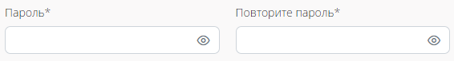

Пароль имеет несколько требований к себе:

1. Он должен состоять минимум из 8, и максимум из 32 символов.
2. Он может состоять из букв кириллицы и латиницы, спецсимволов(@&*#$~.,!?^()[]) и цифр.
3. В пароле обязательно должны быть: Одна заглавная буква, одна строчная буква и одна цифра.

### Кнопка Согласия На Обработку Персональных Данных
Для продолжения регистрации Вам предложат согласиться на обработку персональных данных.
Это согласие необходимо для работы с данными, чтобы платформа могла выполнять свою главную задачу,
по обеспечению взаимодействия между компаниями, студентами и образовательными организациями.

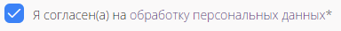

## Второй Этап Регистрации
После заполнения всех необходимых данных на первой странице регистрации,
необходимо нажать кнопку **Продолжить**. 

При нажатии на нее, необходимо заполнить данные на второй странице регистрации.

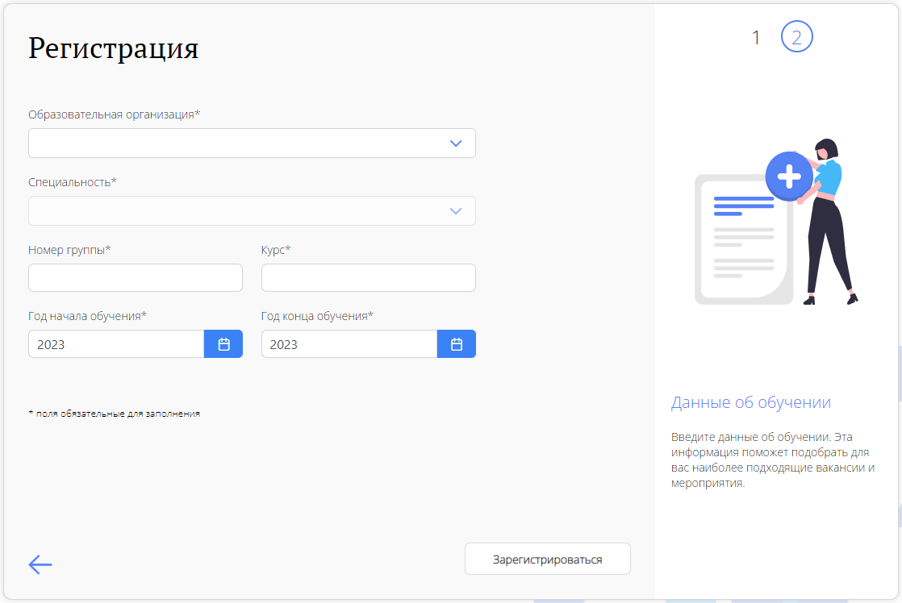

Обязательные поля на этой странице помечены ***(Звездочкой)**.

Рассмотрим все поля поподробнее...

### Выбор Образовательной Организации
При нажатии на это поле, появляется выпадающий список. В нем находятся все образовательные
организации, которые зарегистрированы на платформе. 
Пользователь должен выбрать свою образовательную организацию из этого списка. 

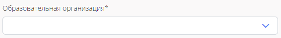

### Выбор Специальности
Это поле не доступно до момента, пока пользователь не выберет свою образовательную организацию.
После выбора образовательной организации, пользователь при нажатии на поле выбора специальности
появится выпадающий список. В нем находятся все специальности, относящиеся к выбранной ранее
образовательной организации.
Пользователь должен выбрать свою образовательную организацию из этого списка.

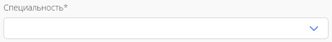

### Ввод Номера Группы и Курса
Поля **Номер группы** и **Курс** - это необходимые поля для заполнения.
В поле **Номер группы** пользователь вписывает номер группы, в которой он обучается.
В поле **Курс** пользователь вписывает курс, на котором он сейчас обучается.

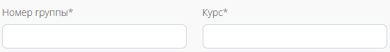

### Выбор Года Начала и Конца Обучения
Поля **Год Начала Обучения** и **Год Конца Обучения** - это необходимые поля для заполнения.
В поле **Год Начала Обучения** пользователь выбирает, из своеобразного календаря,
год начала своего обучения. А в поле **Год Конца Обучения** пользователь выбирает год конца
своего обучения.

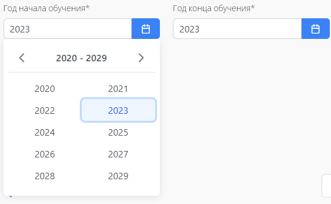

### Кнопка Зарегистрироваться
После заполнения всех обязательных полей на этой странице, пользователь
сможет нажать на кнопку "Зарегистрироваться".

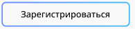

## Этап Добавления Данных
После нажатия на кнопку "Зарегистрироваться", пользователю открывается
новая страница. На ней, пользователю предлагается сразу заполнить свой
аккаунт данными.

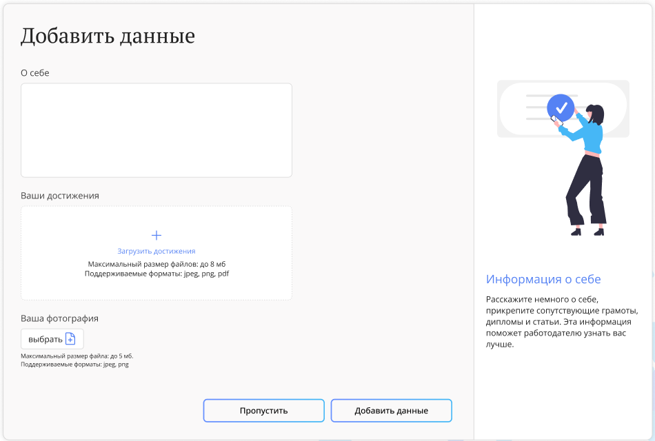

Рассмотрим все поля подробнее...

### Поле О Себе
В этом поле, пользователь может рассказать о себе подробнее: Чем увлекается, Что знает и так далее.

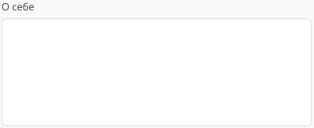

### Добавление Ваших Достижений
В этом поле, пользователь может загрузить свои задокументированные
достижения. Это могут быть сертификаты, дипломы и так далее.
Для загрузки доступны только файлы формата png, jpeg и pdf, размер
которых не превышает 8 мб.

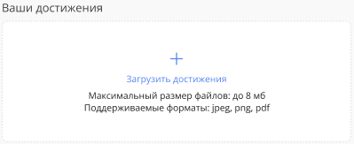

### Добавление Вашей Фотографии
В этом поле, пользователь может добавить фотографию для своего профиля.
Она будет видна всем пользователям на платформе. Для загрузки
доступна только фотография формата png или jpeg, размер которой
не превышает 5 мб.

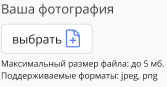

### Кнопки Пропустить и Добавить Данные
Кнопка "Пропустить", позволяет при нажатии пропустить этап заполнения данных.
Пользователь может нажать ее в любой момент, пока находится на странице.
Кнопка "Добавить Данные" доступна, если пользователь заполнил хотя бы
одно из полей на странице. После нажатия на эту кнопку, в профиле
пользователя на платформе будут показываться эти данные.

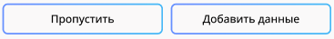
