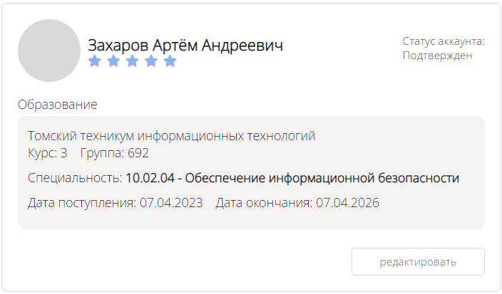
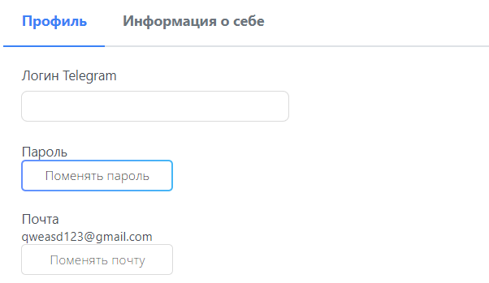

# Личный кабинет студента

## Предназначение
В личном кабинете вы можете увидеть и отредактировать информацию, относящуюся к вашему аккаунту. Более подробно в руководстве ниже.

## Переход в личный кабинет
Для того чтобы перейти в профиль студента, вам необходимо навести курсор мыши на вкладку "Личный кабинет" и нажать на кнопку "Профиль" в верхней части сайта.

## Просмотр информации
После перехода в личный кабинет вы можете просмотреть всю доступную информацию о текущем аккаунте в специальной карточке студента.

## Редактирование информации
Для того чтобы отредактировать какую-либо информацию, относящуюся к своему аккаунту, необходимо нажать на кнопку "Редактировать" в карточке студента.

### Смена пароля
Для того чтобы сменить пароль от своего аккаунта, в окне редактирования на вкладке "Профиль" нажмите на кнопку "Поменять пароль".

В открывшемся окне введите все требуемые данные и нажмите на кнопку "Изменить".

### Личная информация
Каждый студент может отредактировать часть информации о себе, например изменить информацию о себе и сменить аватар. Доступная к редактированию личная информация находится в окне редактирования на вкладке "Информация о себе".

## Просмотр отзывов
Обратите внимание на отзывы о компании, оставленные студентами. Они располагаются в нижней части страницы профиля в личном кабинете.

Платформа сильнее продвигает компании с лучшим рейтингом, поэтому им становится проще привлекать студентов на собственные потребности, мероприятия и вакансии.