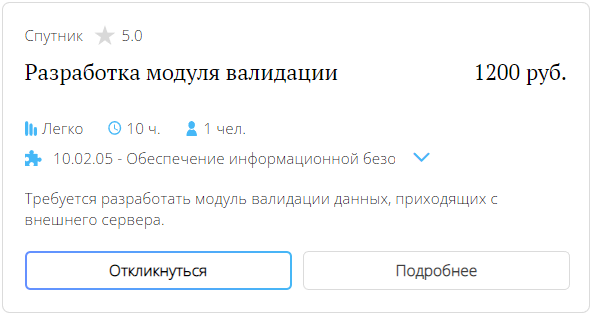

# Отклик на потребности

## Требуемые права
Для отклика на потребности обязательно иметь подтверждённый статус аккаунта. В случае несовпадения или отсутствия каких-либо блоков из перечисленного руководства, скорее всего вас ещё не успели подтвердить, просто подождите некоторое время.

## Как откликнуться на потребность

Вы можете откликнуться на потребность, которую сможете выполнить. Для этого нажмите на кнопку "Откликнуться" в карточке подходящей потребности. Вы получите соответствующее уведомление, как только компания рассмотрит вашу заявку.

## Если отклик приняли
Как только компания выберет вас исполнителем, вы получите уведомление об этом. Статус отклика изменится на "Принят", вас автоматически добавят в чат с сотрудником компании, чтобы обсудить все необходимые шаги для выполнения задачи.
