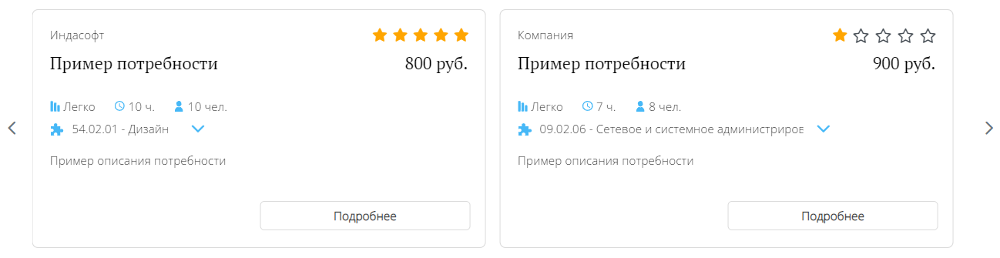

# Просмотр потребностей

## Блок "Потребности"

В данном блоке отображаются карточки с краткой информацией по открытым на платформе потребностям.

## Фильтрация и сортировка

Существует возможность упростить отображение списка потребностей, выбрав дополнительные фильтры и сортировки.

## Подробная информация

Страницу с подробной информацией можно открыть нажатием на кнопку "Подробнее".

## Блок "Активные потребности"

В данном блоке отображаются потребности, на которых студент назначен исполнителем. Если у студента нет активных потребностей, блок не отображается на странице.

